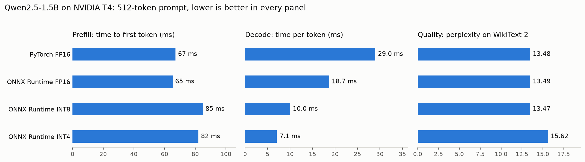
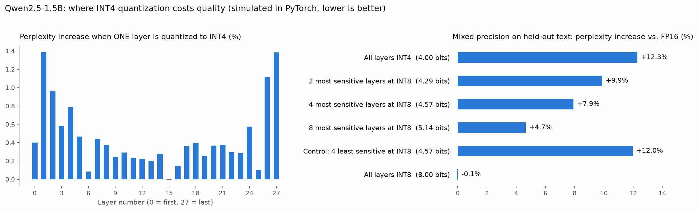

# LLM Inference Analysis: PyTorch vs. ONNX Runtime, FP16 vs. INT8 vs. INT4

Where does the time go when a language model generates text, and what do a faster
engine and smaller weights actually buy you?

I ran **Qwen2.5-1.5B-Instruct** on an **NVIDIA T4** four ways and measured the two
phases of inference separately: **prefill** (reading the prompt) and **decode**
(writing one token at a time).



## Results

| Configuration | Prefill (TTFT) | Decode (per token) | Decode speed | Model size | Perplexity |
|---|---|---|---|---|---|
| PyTorch FP16 | 67 ms | 29.0 ms | 34.5 tok/s | ~3.1 GB | 13.48 |
| ONNX Runtime FP16 | 65 ms | 18.7 ms | 53.5 tok/s | 3.11 GB | 13.49 |
| ONNX Runtime INT8 | 85 ms | 10.0 ms | 99.7 tok/s | 2.13 GB | 13.47 |
| ONNX Runtime INT4 | 82 ms | 7.1 ms | 141.5 tok/s | 0.89 GB | 15.62 |

Setup: 512-token prompt, 64 generated tokens, batch size 1, greedy decoding.
Lower is better for every column except decode speed.

## What I found

**1. ONNX Runtime made decode 1.5x faster and left prefill unchanged.**
Same model, same weights, same GPU; only the engine changed. Decode went from
29.0 ms to 18.7 ms per token. Prefill stayed at about 65 ms.

**2. Quantization made decode much faster and prefill slower.**
INT4 decode is 2.6x faster than ONNX FP16 and 4.1x faster than PyTorch. But
prefill got about 26% slower for both INT8 and INT4.

**3. INT8 cost no measurable quality. INT4 cost about 16%.**
Perplexity for INT8 (13.47) is within noise of FP16 (13.49). INT4 rose to 15.62.
PyTorch and ONNX Runtime FP16 agree (13.48 vs. 13.49), which confirms the export
is correct.

**So on this model and GPU, INT8 is the sweet spot:** 2.9x faster decode than
PyTorch with no measurable quality loss. INT4 is worth it when memory or decode
speed matters more than quality.

## Why prefill and decode behave differently

The two phases are limited by different things.

- **Decode is limited by memory.** Each step produces one token, but the GPU
  still has to read the model's weights to do it. There is very little math per
  byte read, so the speed of reading weights sets the pace. Smaller weights mean
  less to read, which is why INT8 and INT4 speed decode up.
- **Prefill is limited by compute.** The same weights are read once but used for
  512 tokens of math, so the GPU's arithmetic is the bottleneck. Quantized
  weights have to be unpacked before they can be multiplied, which adds work to
  the part that was already the bottleneck. That is why prefill slows down.

Per token, prefill is about 200x more efficient than decode in the PyTorch
baseline (0.13 ms vs. 29 ms).

## A model I tested, and where it fell short

After the FP16 and INT4 runs, I fit a line through the two decode times:

    decode time = 2.4 ms fixed cost + 5.2 ms per GB of model file

I then used it to predict INT8 before running it. For INT8's 2.13 GB file the
line predicts 13.6 ms. I measured 10.0 ms.

My hypothesis for the gap: file size is not the same as bytes read per token.
The INT8 file is about 0.5 GB larger than 8-bit weights alone would be, which
matches the size of the token embedding table stored in FP16. That table is only
looked up one row at a time, not read in full. Subtracting it gives about 1.66 GB
read per step and a prediction of about 11 ms, much closer to the measurement.

I have not yet opened the ONNX files to confirm this, so it remains a hypothesis.

## Part 2: which layers cause INT4's quality loss?

INT4 raised perplexity by about 16% in the ONNX Runtime runs. To find where that
loss comes from, I simulated INT4 in PyTorch: I rounded selected weight matrices
to 16 levels with the same scale-factor scheme, left everything else in FP16, and
measured perplexity on about 20,000 tokens of WikiText-2.



**By type of weight** (all 28 layers):

| Quantized to INT4 | Perplexity | Change |
|---|---|---|
| Nothing (FP16) | 11.93 | baseline |
| Attention weights only | 12.22 | +2.5% |
| Feed-forward weights only | 13.13 | +10.0% |
| Both | 13.44 | +12.7% |

The feed-forward weights cause about four times as much loss as the attention
weights. The two effects add up almost exactly (2.5 + 10.0 vs. 12.7).

**By layer.** Quantizing one layer at a time shows a U-shape: layers 1 to 5 and
the last two layers (26 and 27) are the most sensitive, and the middle layers
matter least. The 28 single-layer increases sum to 12.6%, close to the 12.3 to
12.7% measured with every layer quantized, so the layers also behave almost
independently.

**Mixed precision.** I ranked the layers on one half of the text, then tested
mixed configurations on the other half:

| Configuration | Bits per weight | Perplexity change |
|---|---|---|
| All layers INT4 | 4.00 | +12.3% |
| 2 most sensitive layers at INT8 | 4.29 | +9.9% |
| 4 most sensitive layers at INT8 | 4.57 | +7.9% |
| 8 most sensitive layers at INT8 | 5.14 | +4.7% |
| Control: 4 least sensitive layers at INT8 | 4.57 | +12.0% |
| All layers INT8 | 8.00 | -0.1% |

Keeping the 4 most sensitive layers at INT8 removes about a third of the loss
for 14% more bits. The control, which protects the 4 least sensitive layers at
the same cost, removes almost none, so the ranking carries real information and
it holds on text it was not chosen on.

The gain is moderate, not dramatic. Sensitivity is concentrated in a few layers,
but most of the loss is still spread across the rest.

**What this part does not show.** The quantization is simulated, so these are
quality numbers only; I have not built a mixed-precision ONNX model or measured
its speed. The simulation's +12.7% is consistent with, but not identical to, the
+16% from ONNX Runtime; the two used different text samples, and the ONNX model
builder may quantize parts this script leaves in FP16. "Bits per weight" counts
the layer weights only and ignores the stored scale factors.

## How I measured

- **TTFT:** time from submitting the 512-token prompt to having the first new token.
- **Decode time:** median time per token over 64 decode steps.
- Two warmup runs are discarded; each number is the median of five trials.
- GPU work is asynchronous, so every timing waits for the GPU to finish
  (`torch.cuda.synchronize()` in PyTorch; copying the token back to the CPU in
  ONNX Runtime). Without this the numbers look falsely fast.
- **Perplexity:** 4,088 tokens of the WikiText-2 test set in eight 512-token
  chunks, scored with the same token IDs for every configuration.
- Run-to-run variation was about 5%, so I don't treat smaller differences as real.

## Limitations

- One model, one GPU, batch size 1, and one prompt length.
- Perplexity uses a small sample (about 4,000 tokens).
- Quantization used the model builder's default settings. Other quantization
  methods may lose less quality at INT4.
- GPU memory is not compared across engines, because the two were measured
  differently.

## Files

| File | What it does |
|---|---|
| `baseline_pytorch.py` | PyTorch FP16 baseline: TTFT, decode time, peak memory |
| `onnx_benchmark.py` | Exports to ONNX Runtime GenAI (fp16 / int8 / int4) and benchmarks |
| `quality.py` | Perplexity on WikiText-2 for all four configurations |
| `plot.py` | Draws `results.png` from the saved results |
| `sensitivity.py` | Part 2: INT4 on attention vs. feed-forward weights |
| `sensitivity_layers.py` | Part 2: per-layer sensitivity and mixed precision |
| `plot_sensitivity.py` | Draws `results_sensitivity.png` |
| `chat.py` | Sends one real question to the model and prints the answer |
| `results_*.json` | Raw results |

## Reproduce

```bash
pip install modal matplotlib
modal setup

modal run baseline_pytorch.py
modal run onnx_benchmark.py --precision fp16
modal run onnx_benchmark.py --precision int8
modal run onnx_benchmark.py --precision int4
modal run quality.py
python plot.py

modal run sensitivity.py
modal run sensitivity_layers.py
python plot_sensitivity.py
```

Built with PyTorch, Hugging Face Transformers, ONNX Runtime GenAI, and Modal.